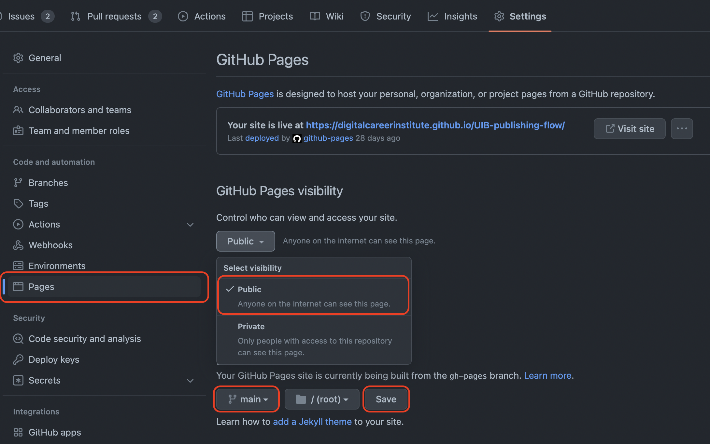

# Publishing Workflow
[](#-results)


Let's make our work public to share it with the world. Pay attention to **legal regulations** (no hate, no bullying, no misinformation, etc.).

Note: This was last updated in **July 2021**. At that time...

* ...the settings for Github pages are located under: **Settings** tab / **Pages** submenu.
* ... The default branch name of Github is currently `main`. This has changed over time. If you want to publish older repositories or use older versions of the command line tool, you must rename the old `master` branch with `git branch -m main` before following this guide.

## Idea

We will use the Github service Github pages to publish the content of repositories on a publicly accessible URL in the form of https://accountname.github.io/repositoryname/.

There are a few things you need to keep in mind:

1. Github Pages by default translates Markdown files (like README.MD) into HTML using a program called [Jekyll](https://jekyllrb.com/). We want to write our own HTML/CSS, so we will disable this default behavior.
2. Github pages only works for public repositories for basic accounts. (PRO accounts can also publish private repositories)

## Instructions

1. Create a repository on your personal GitHub account.
    * If you have a free GitHub account, the repository for this exercise must be **public**.
2. Copy the address of your repository and clone it locally on your machine with `git clone yourCopiedLink`.
3. Create an `index.html` file as a starting point and fill it with some text blocks (e.g., a document title and a first-level heading `<h1>Hello public world</h1>`)
4. Make a first commit by staging (`git add index.html` and `git commit -m "initial commit"`)
    * You _can push the `main` branch with `git push origin main` to github
    * (this step is _optional_, as we will be using a different branch)
5. By default, Github Pages are published with a `gh-pages` branch
    * Let's create such a branch as a copy of the current (`main`) by typing `git checkout -b gh-pages` in the terminal.    
6. Push the new branch with `git push origin gh-pages` to the remote Github repository.
7. Enable GitHub Pages for the repository.
    * Go to the Settings tab of your repository and navigate to the **Pages** submenu on the left 
    * Set "gh-pages" as the live branch and /(root) as the live directory. 
    * Github displays the URL of your public page at the top of the Source section. It then looks like this: https://youraccount.github.io/repositoryname/
    * If you now follow the link, you will see a rendered version of the readme.md of the repository (if you enabled this option when creating the repository) or an error message saying there is nothing to show.
8. Disable Jekyll.
    * You can turn off the default behavior (translating Markdown files into HTML) by creating a file named `.nojekyll` in the directory you selected for publishing.
    * Create such a file with VSC or in the terminal by typing `touch .nojekyll` in the terminal. Pay attention to the dot (`.`) before the filename
9. Submit this change to github
    * stage the changes in the directory with `git add .`
    * Make a new commit with `git commit -m "added .nojekyll"`
    * Push them with `git push origin gh-pages` to the remote directory
10. Visit the public URL (e.g., https://youraccount.github.io/repositoryname/) and check if everything works as it should.



Sure, here is the English translation of your text:

## Bonus: gh-pages npm package

There is an NPM package `gh-pages` that helps automate the steps to update your published page while you work from the main or other branches.

You can install it globally on your system with `npm install -g gh-pages@3.0.0` to avoid adding a package.json to very simple small projects with pure HTML/CSS.

With the package, you can work in your main branch or in other branches and control which directory you want to publish and thus make public in the gh-pages branch.

### Example call.

Suppose you are working in the root directory of your main branch and want to move and publish the entire content to the gh-pages branch, then enter:

```bash
gh-pages -d ./
```

You can also specify a different subdirectory that becomes the root directory of the publication.

```bash
gh-pages -d dist
```

This is useful if you use development tools (like sass) to create a `/dist/` directory (=distribution) for the publication of other source files.

The content of the subdirectory becomes the content of the **root** of the `gh-pages` branch

**Important note**:
There is a known [issue](https://github.com/tschaub/gh-pages/issues/354) with gh-pages versions >3.0.0 with the configuration of a temporary directory when there is no package.json (i.e., with the globally installed package), which ends with `The "path" argument must be of type string. Received undefined`. In this case, you must ensure that you are using exactly version 3.0.0 of gh-pages in a global installation (or have a package.json in your project with gh-pages in the development dependencies). To switch from another installed version to exactly 3.0.0, enter `npm install gh-pages@3.0.0 -g` in your terminal.

[//]: # (autograding info start)
#  Results
> ⌛ Give it a minute. As long as you see the orange dot  on top, CodeBuddy is still processing. Refresh this page to see it's current status.
>
> This is what CodeBuddy found when running your code. It is to show you what you have achieved and to give you hints on how to complete the exercise.


### Page

|                 Status                  | Check                                                                                    |
| :-------------------------------------: | :--------------------------------------------------------------------------------------- |
|  | `index.html` file exists and contains `h1` element |

### Publishing

|                 Status                  | Check                                                                                    |
| :-------------------------------------: | :--------------------------------------------------------------------------------------- |
|  | This repository is published on GitHub pages |


[🔬 Results Details](../../actions)
[🐞 Tips on Debugging](https://github.com/DCI-EdTech/autograding-setup/wiki/How-to-work-with-CodeBuddy)
[📢 Report Problem](https://docs.google.com/forms/d/e/1FAIpQLSfS8wPh6bCMTLF2wmjiE5_UhPiOEnubEwwPLN_M8zTCjx5qbg/viewform?usp=pp_url&entry.652569746=UIB-publishing-flow)


[//]: # (autograding info end)